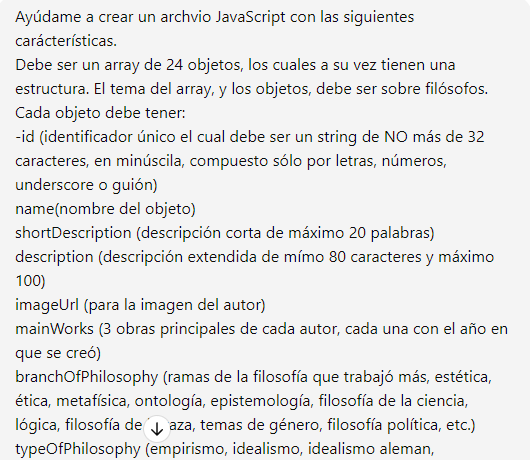
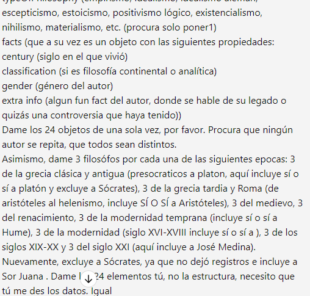
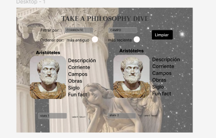

# Dataverse

## Índice

* [1. Definición del Producto](#1-definicion-del-producto)
* [2. Funcionalidades y estructura de la página](#2-funcionalidades)
* [3. Historias de Usuario](#3-historias-de-usuario)
* [4. Diseño y prototipos](#4-prototipos)
* [5. Tests desarrollados](#5-tests)

***

## 1. 📚 Definición del Producto
*σοφία αιώνια* -Sabiduria Eterna- es una SPA (Single Page Application) desarrollada en los lenguajes `HTML`, `Java Script` y `CSS`, cuyo principal objetivo es brindar a los usuarios un primer acercamiento a la filosofía. 
Proporciona información de 24 de los filósofxs más importantes de la historia, desde Platón hasta Judith Butler, señalando sus obras más importantes, así como las corrientes de la filosofía a las que pertenecen y sus áreas de investigación. La página además permite la interacción via un chat grupal o individual, para que las usuarias puedan resolver sus dudas específicas, o entablar un debate apasionado con sus filosofxs preferidxs
*σοφία αιώνια* es un intento por seguir abonando a la difusión y divulgación de la filosofía, disciplina que nos atañe a todos y de la cual siempre se puede seguir aprendiendo.
Anímate a tomar __un clavado filosófico__ 🚀

## 2. 🔧 Funcionalidades y Estructura:

Como se mencionó anteriormente, la página es una SPA y cada una de las vistas tiene sus propias funcionalidades, las cuales corresponden tanto a las especificaciones del readme, como a las necesidades que se identificaron de los usuarios.
De toda el proyecto, se considera que la función principal es la de __Router__ la cual permite la visualización de la página y la navegación dentro de la misma.  Para ello, se configuró un componente *header* que permita a los usuarios cambiar de vista con un sólo click en alguno de los botones, o regresar a la vista principal haciendo click al logo.

### 2.1 Vista Home.
La vista *Home* y sus funcionalidades fueron migradas desde el anterior proyecto *dataverse*, refactorizandose cuestiones mínimas sobre el código para permitir su fácil entendimiento y correcta integración con el resto de la página y de las vistas. 
__Funcionalidades de Home__:
- __Visualización__: Se crearon tarjetas cuyos elementos cuentan con las propiedades de `microdatos` como `itemscope` `itemtype` e `itemprop`.  
- __Filtrado__: Las usuarias pueden filtrar la data mediante diversos menus desplegables `select` que corresponden a distintas propiedades. Se cuenta con un botón para las ramas de la filosofía, otro para la clasificación (analítica o continental) y otro para la corriente filosófica. Asimismo hay una `barra de búsqueda` que permite que las usuarias encuentren a unx filosófx en específico sólo ingresando su nombre.
- __Ordenado__: Las usuarias pueden decidir si quieren observar la data en orden ascendente o descendiente de acuerdo al año en que haya sido cada filósofx. Para ello igualmente cuentan con un menú desplegable `select`.
- __Estadísticas__: La página muestra tres datos que se consideran de interés de acuerdo a la información mostrada: Filósofxs por género, por clasificación y anteriores al siglo XIX. Se cuentan con dos gráficas para ilustrar las estadísticas de género y las de clasificación
- __Botones__: Además de las funcionalidades anteriormente enlistadas, la página cuenta con un *botón de limpieza*, el cual resetea los filtros seleccionados y vuelve a la vista original de la página. Existe un *boton de estadísticas* el cual despliega los cálculos anteriormente mencionados, un *boton de búsqueda* para la barra de búsqueda y un *boton de filtros* el cual muetra los filtros anteriormente descritos en un menu desplegable a la derecha.

### 2.2 Vista ApiKey
La vista ApiKey se creó para que las usuarias puedan configurar desde aquí la clave que permitirá el funcionamiento del resto de las vistas.
__Funcionalidades de ApiKey__:
__Configuración del apikey__: Esta vista cuenta con un Input Text y dos botones que permiten el guardado y borrado de la apikey que hará posible la interacción con la inteligencia artificail en los chats individuales y el grupal.
__Botones__: Botón de borrado y guardado de la apikey, ambos responden a las funciones setItem y removeItem.

### 2.3 Chat Individual:
Una vez haciendo click a alguna de las tarjetas del filosofx que más les interesen, las usuarias serán dirigidas a la vista chatIndividual, en donde conocerán más del personaje e incluso podrán interactuar con ellx. 
__Funcionalidades de Chat Individual__:
__Tarjeta__: En la vista de Chat individual (para la versión escritorio), se cuenta con una tarjeta de información al lado izquierdo de la pantalla, la cual alberga nombre, una descripción más detalladas y las corrientes, áreas de investigación y obras más importantes del filósfox señaladx.
__Chat__: La página cuenta con un chat individual, a su vez enlazado con una API de OpenAI que permita a las usuarias enviar preguntas a su filosofx preferido!. El chat almacena los mensajes de ambas partes, asi como ofrece un pequeño header en donde se indica que el personaje está en líne!.

## 2.4 Chat Grupal
Si así lo desean, las usuarias pueden también charlar con todos lxs filósofxs a la vez! La vista de chat grupal permite que una misma duda sea respondida por 24 de las voces más importantes en la historia de la filosofía.
__Funcionalidades de Chat Grupal__
__Contenedor__: Al lado derecho de la pantalla (en la versión de escritorio) las usuarias se encontrarán con un contenedor que enliste a todos lxs filósofxs que están participando!
__Chat__: Al lado izquierdo, está el contenedor del chat grupal, enlazado con una API de OpenAI que permite a las usuarias enviar preguntas a todo el panel de expertos!

## 2.5 Vista de Error.
En caso de que el usuario quiera acceder a una vista que no exista, la página les redirecciona a la página de error, desde la cual, tal como sísifo, podrán regresar al incio para poder volver emprender su aventura filosófica!

## 3. Prompting:
La generación de los datos se realizo mediante la herramienta de Inteligencia Artifical `ChatGPT`de OpenAI. Mediante un prompt específico se le pidio que generara un array de 24 objetos con los `KeyElements`: id, shortDescription, description, facts, name, entre otros.
A continuación se deja el prompt utilizado:
 

## 4. Historias de Usuario:
Se crearon diversas historias de usuario para el diseño y programación de la página.

**Card:** Como persona que tiene un primer acercamiento en la filosofia quiero saber el nombre de algunos de los filosofos mas importantes de la historia, para familiarizarme con ellos.
**Criteria:** La página debe mostrar una lista de al menos 24 filósofos reconocidos.
Cada filósofo debe estar acompañado de una breve biografía.
Debe haber una imagen representativa de cada filósofo.

**Card:** Como estudiante, quiero saber algunos de los trabajos más importantes de esos filósofos, para poder buscarlos después.
**Criteria**Se deben enumerar al menos tres obras importantes de cada filosofo
Cada obra debe tener al menos el año en que se creó, el título y el tema tratado en ella.
-Opcional (poder poner links a esas obras/pdfs)

**Card:** Como estudiante, quiero saber qué filosofos trabajaron temas relacionados a x rama, pues necesito hacer una investigación sobre ese tema
**Criteria:** -La información de los filosofos debe tener las ramas a las que se dedicaron.
-Debe haber un botón de filtrado que permita filtrar por rama de la filosofia y muestre todos los filosofos que se dedicaron a ello.

**Card:** Como estudiante, quiero saber qué filosofos pertenecieron a x corriente, pues estoy interesandome en saber más sobre ésta
**Criteria:** Función de filtrado que permita conocer qué filosofos se dedicaron a x corriente
La información de los filosofos debe destacar esta información

**Card:** Como profesional de la filosofia quiero saber cuántos filosofos son de la rama continental, pues quiero conocer más sobre esa corriente 
Como usuaria primeriza, quiero saber cuántas mujeres filosofas hay y cuáles fueron sus principales intereses
**Criteria:** Funciones de calculo que permitan saber más sobre esta información y que muestre gráficas.

**Card:** Como usuaria de la página, quiero que los filtros se encuentren en una sección donde sea facil distinguirlos y en donde no tomen demasiado espacio para no hacer mucho scroll
**Criteria:** Realizar un menu lateral desplegable en donde se almacenen los filtros

## 5. 🖼️ Prototipos de alta fidelidad:
Con base en las Historias de usuario anteriormente descritas se crearon dos prototipos de alta fidelidad, los cuales sirvieron como guía para la creación de la página web, aunque se realizaron algunas modificaciones sobre estos al momento de realizar el diseño final, principalmente en la cuestión de colores. No obstante, el acomodo de los elementos y visualización de datos siguio esta estructura.
 

Coded by Alhelí De Vicente García❤️
- __Test Unitarios__: Para asegurar el correcto funcionamiento del filtrado, ordenado y cálculo estadísticas se desarrollaron test usando el framework `jest` que cubrieran al menos el 70% de las funciones.